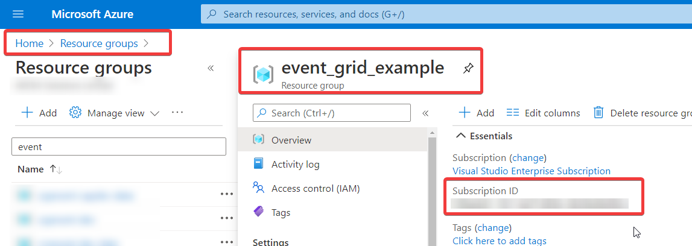
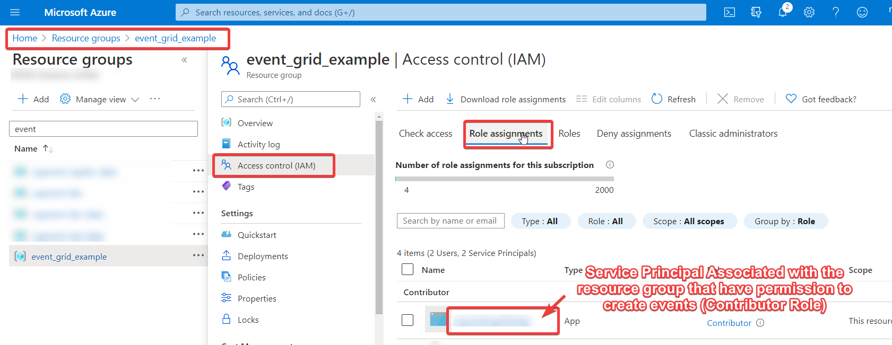
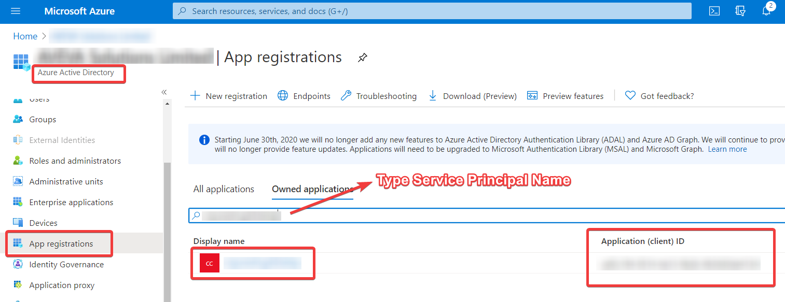
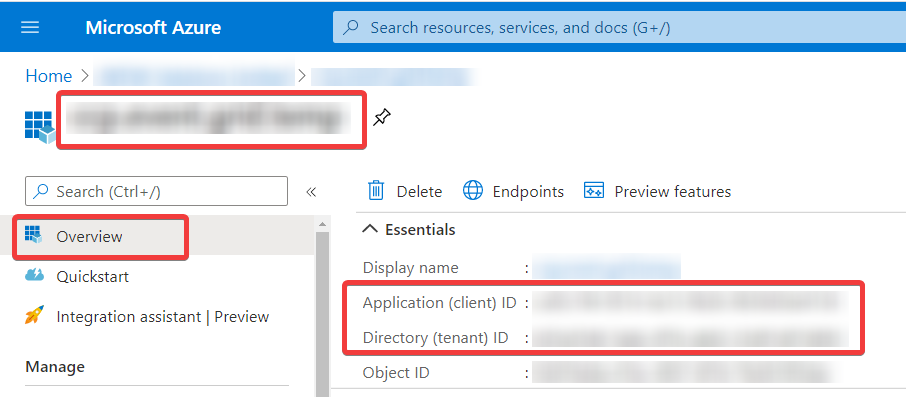

# Event Grid Examples

## How to retrieve parameters from Azure Portal 

- credentialsAzureSubscriptionId

- credentialsTenantId
- credentialsClientId

- credentialsClientSecret

Can only be retrieved when the service principal is created. You can create new secret in the *Certificates and Secrets* option.

